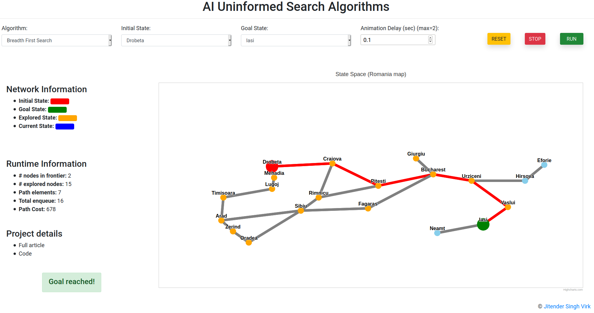

# Artificial Intelligence Uninformed Search Algorithms (Interactive Web App)
This repo contains the code of interactive web app of AI uninformed search algorithms.

 

**Overview**: An  interactive  web  app  that demonstrates  the  working  of  four  uninformed  problem-solving algorithms: breadth first search, depth first search, depth limitedsearch,  and  iterative  deepening  depth  first  search.  The  examplestate  space  is  the  simplified  map  of  Romania,  a  southeastern European country. Each node in the state space represents a cityof Romania. The web app also provides run-time resources stats such as number of nodes in the queue, path elements, path cost. The purpose of this demonstration is to visualize the working of uninformed problem-solving algorithms.

* [**The web app is available here**](https://aiuninformedsearchalgos.pythonanywhere.com)

* [**Read short paper here**](https://cumailin-my.sharepoint.com/:b:/g/personal/20mai1035_cuchd_in/EUtqdWoxHrxLowAyAK0R1A0B3Np1bmTvT9QNkFhunJfmXg?e=KiDalN)
